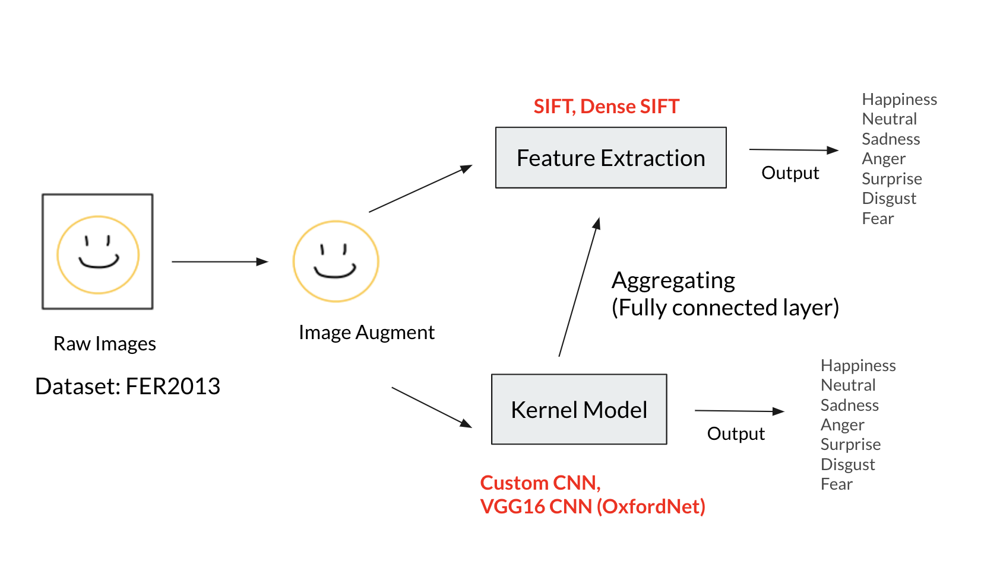
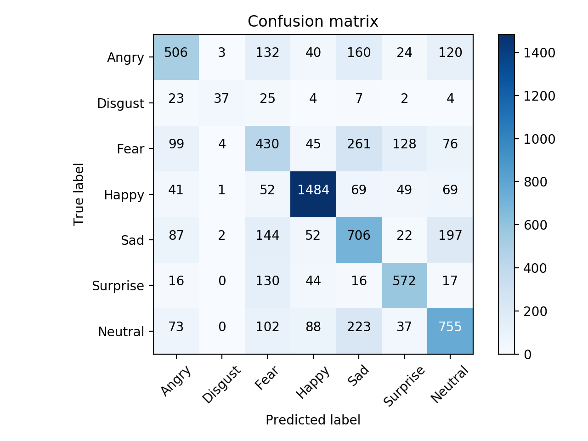

# Facial Expression Recognition
### CNN model aggregated with SIFT/DSIFT descriptors

## Introduction

This project proposed several aggregated models doing facial expression recognition on Facial Expression Recognition 2013(FER2013) dataset. These models based on custom CNN model and VGG16 with SIFT and Dense SIFT feature descriptors and aggregated different models to see how aggregated model performance at the end. 

Figure shows the overview of this project:

  
  

  
## Dataset
All the training and evaluations are done on Kaggle dataset - *Facial Expression Recognition 2013 (FER2013)*.
Input are various 48x48 resolution grayscale images (one channel), along with label corresponding to one of seven emotions, 0 = Angry, 1 = Disgust, 2 = Fear, 3 = Happy, 4 = Sad, 5 = Surprise, 6 = Neutral [[Dataset Link](https://www.kaggle.com/deadskull7/fer2013)]

Example figures for FER2013 dataset:

 
 
## Classification Results

- Training result:

  The table shows the validation accuracy and testing accuracy

  Methods | Accuracy_val(%) | Accuracy_test(%)
  ------------ | -------------|  -----------
  CNN | 63.57 | 62.55
  SIFT_CNN | 62.6 | 61.24
  DIFT_CNN | 60.05 | 58.99
  VGG | 68.16 | 66.75
  SIFT_VGG | 67.19 | 66.66
  DIFT_VGG | 68.1 | 67.69

- Aggregated Models:

  "Aggregated" means combining original model and both models using SIFT and Dense SIFT

  Methods | Accuracy(%) 
  ------------ | -------------
  CNN + SIFT-CNN  | 64.89
  CNN + DSIFT-CNN | 63.54
  Aggregated CNN  | 65.07
  VGG + SIFT-VGG  | 69.20
  VGG + DSIFT-VGG  | 69.45
  Aggregated VGG | 70.37

- Confusion Matrix results can be found under `ConfusionMatrix` file. 

  e.g. Results of CNN model

  


## Prerequisites

Make sure installed these prerequisites before running the code. The installation can be done by using `pip`
```bash
- Python 3.7.6
- matplotlib 3.1.2 
- numpy 1.18.1
- Keras 2.3.1
- scikit-learn 0.22.1
- opencv-python 3.4.2.16
```

## Usages

Clone this file and run the following program using 
```bash
$ git clone https://github.com/chiehhsi/Expression_Recognition.git
$ cd path/to/this/file
```

### I. Download and Preprocess Data

Download the dataset file `fer2013.csv` from [here](https://www.kaggle.com/deadskull7/fer2013) and put in the root folder of this package.

Preprocess the data and create `dataX.npy` and `dataY.npy` inside root folder
```bash
$ python3 preprocessing.py
```

### II. Feature Descriptors

Make sure there are `sift_histogram.npy` and `d_sift.npy` under `Result` folder for SIFT/ Dense SIFT descriptors respectively

These two files can be found by either from exisiting files or building from scratch

1. Get the descriptors by scratch

   If you directly launch the train models, then it will automatically generate otherwise comment out the buttom line inside `feature_extraction.py` and simply run 
   ```bash
   $ python3 feature_extraction.py
   ```
   you will get two `.npy` files for SIFT and Dense SIFT descriptors.
   
   Besides, the command will also produce `pics` file containing all 48\*48 pixels grayscale figures from FER2013 dataset about size 54.7 MB 
   
2. Existing files
   
   Details refer to `Result/README.txt` [here](https://github.com/chiehhsi/Expression_Recognition/tree/master/Result)

 

### III. Train Models

Launch training 
```bash
$ python3 training_model.py
```
There are also optional arguments according to the needs:
- `--model` (str) : Initial Model type {cnn, scnn, dcc, vgg, svgg', dvgg}, **default = cnn**
- `--epochs` (int) : Number of epochs to run,  **default = 100**
- `--batchsize` (int) : Number of images to process in a batch,  **default = 100**

e.g. `$ python3 training_model.py --model svgg --epochs 200`

The `model.py` defined the structure of CNN model and layers; `model_vgg.py` is for VGG16.

The built models in this project can found [here](https://github.com/chiehhsi/Expression_Recognition/tree/master/Result) which can be downloaded and use them directly. Make sure all files are under `Result` folder instead the unzip located files.

When facing interrupted during training, as the repository already has `model.json`(trained model) and `model.hdf5`(parameters) simply run the command to resume the training process
```bash
$ python3 resume_train.py
```
The training history is saved in `model_histo.npy` files, change the filepath inside `plotgraph.py`. Run the command to get the plotting results of the accuracy and loss for training process.
```bash
$ python3 plotgraph.py
```

Every `.py`, model structure, and parameters can be modify according to users' needs.

### IV. Test Models

To get the test accuracy and results of confusion matrix.  Run command below produces the accuracy and confusion matrix for each model, e.g. `ConfusionMatrix\*.png`.

```bash
$ python3 predict.py
```

If error occurs, please check if there exists `.json` and `.hdf5` files for the same model under `Result` folder, which has been generated automatically if the training finished successfully. Otherwise, please rerun the training process or download built models. **Train Models** section has more details.

## References

- Mundher Al-Shabi, ooi Ping Cheah, Tee Connie, **Facial Expression Recognition Using a Hybrid CNN-SIFT Aggregator** [[arXiv1608.02833](https://arxiv.org/abs/1608.02833)]
